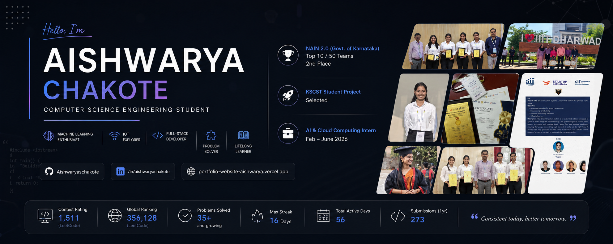

  

<h1 align="center">Hi 👋, I'm Aishwarya Chakote</h1>

  

  

---

# 🌸 About Me

I'm **Aishwarya Chakote**, a final-year Computer Science Engineering student who loves turning ideas into real-world solutions through technology.

I enjoy building projects that solve practical problems, whether it's developing web applications, exploring Machine Learning, working with IoT devices, or sharpening my problem-solving skills through DSA.

One of the most meaningful experiences in my journey has been leading a **Government of Karnataka funded innovation project**, where I worked with IoT and Machine Learning to build a smart irrigation system for grape cultivation.

I'm currently preparing for **Software Engineering roles** while continuously learning, building, and improving every day.

---

# 🚀 What I'm Currently Working On

- 🌱 Solving DSA problems consistently
- 💻 Building real-world web applications
- 🤖 Exploring Machine Learning concepts
- 🎨 Improving UI/UX design skills
- 📚 Learning React and strengthening development skills
- 💼 Preparing for Software Engineering placements

---

# 🏆 Featured Project

## 🌿 Smart Irrigation System for Grape Cultivation using IoT & Machine Learning

**Government of Karnataka Funded | NAIN 2.0**

As the **Project Lead**, I led the development of an intelligent irrigation system designed to help farmers make better irrigation decisions using real-time sensor data and Machine Learning.

### Technologies Used

- ESP32
- Raspberry Pi 5
- Firebase
- Machine Learning
- IoT Sensors
- Python
- Embedded Systems

### Key Features

- 📡 Real-time environmental monitoring
- 💧 Smart irrigation recommendations
- ☁️ Cloud data storage using Firebase
- 📱 Mobile monitoring support
- 🤖 Machine Learning based decision making

This project strengthened my technical, leadership, teamwork, and problem-solving skills while working on real hardware and software integration.

---

<h1 align="center">💻 Tech Stack</h1>

<table width="90%">
<tr>

<td valign="top" width="50%">

### 👨‍💻 Languages

  

---

### 🌐 Frontend

  

---

### ⚙️ Backend & Database

  

#### Also Worked With

`REST APIs` • `JSON`

</td>

<td valign="top" width="50%">

### 🤖 AI / ML

- Machine Learning
- Natural Language Processing (NLP)
- Data Preprocessing
- NumPy
- Pandas
- Matplotlib
- Regression Models

---

### 🔧 Developer Tools

  

---

### 📡 Embedded Systems

`ESP32` 

`Raspberry Pi 5`

`LoRa`

`GSM Module`

</td>

</tr>
</table>

---

# 📊 GitHub Analytics

---

# 🐍 Contribution Snake

  

---

# 🌐 Connect With Me

  

---

✨ Thanks for stopping by! Every repository here reflects my journey of learning, building, and growing as a developer.

